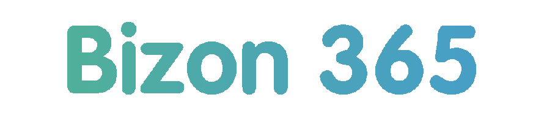

# Bizon365 API PHP Wrapper



Обертка на PHP7+ для работы с [REST API v1 Бизон365](https://blog.bizon365.ru/api/v1/) c троттлингом запросов к API и логированием в файл.

## Содержание

<!-- MarkdownTOC levels="1,2,3,4,5,6" autoanchor="true" autolink="true" -->

- [Требования](#%D0%A2%D1%80%D0%B5%D0%B1%D0%BE%D0%B2%D0%B0%D0%BD%D0%B8%D1%8F)
- [Установка](#%D0%A3%D1%81%D1%82%D0%B0%D0%BD%D0%BE%D0%B2%D0%BA%D0%B0)
- [Класс `Bizon365API`](#%D0%9A%D0%BB%D0%B0%D1%81%D1%81-bizon365api)
    - [Общие методы класса](#%D0%9E%D0%B1%D1%89%D0%B8%D0%B5-%D0%BC%D0%B5%D1%82%D0%BE%D0%B4%D1%8B-%D0%BA%D0%BB%D0%B0%D1%81%D1%81%D0%B0)
    - [Методы для получения отчетов по вебинарам](#%D0%9C%D0%B5%D1%82%D0%BE%D0%B4%D1%8B-%D0%B4%D0%BB%D1%8F-%D0%BF%D0%BE%D0%BB%D1%83%D1%87%D0%B5%D0%BD%D0%B8%D1%8F-%D0%BE%D1%82%D1%87%D0%B5%D1%82%D0%BE%D0%B2-%D0%BF%D0%BE-%D0%B2%D0%B5%D0%B1%D0%B8%D0%BD%D0%B0%D1%80%D0%B0%D0%BC)
        - [Примеры](#%D0%9F%D1%80%D0%B8%D0%BC%D0%B5%D1%80%D1%8B)
    - [Методы для работы с подписичками](#%D0%9C%D0%B5%D1%82%D0%BE%D0%B4%D1%8B-%D0%B4%D0%BB%D1%8F-%D1%80%D0%B0%D0%B1%D0%BE%D1%82%D1%8B-%D1%81-%D0%BF%D0%BE%D0%B4%D0%BF%D0%B8%D1%81%D0%B8%D1%87%D0%BA%D0%B0%D0%BC%D0%B8)
        - [Примеры](#%D0%9F%D1%80%D0%B8%D0%BC%D0%B5%D1%80%D1%8B-1)
- [Вспомогательные классы](#%D0%92%D1%81%D0%BF%D0%BE%D0%BC%D0%BE%D0%B3%D0%B0%D1%82%D0%B5%D0%BB%D1%8C%D0%BD%D1%8B%D0%B5-%D0%BA%D0%BB%D0%B0%D1%81%D1%81%D1%8B)
    - [Класс `HTTP`](#%D0%9A%D0%BB%D0%B0%D1%81%D1%81-http)
        - [Примеры](#%D0%9F%D1%80%D0%B8%D0%BC%D0%B5%D1%80%D1%8B-2)
    - [Класс `DebugLogger`](#%D0%9A%D0%BB%D0%B0%D1%81%D1%81-debuglogger)
        - [Примеры](#%D0%9F%D1%80%D0%B8%D0%BC%D0%B5%D1%80%D1%8B-3)
- [Автор](#%D0%90%D0%B2%D1%82%D0%BE%D1%80)
- [Лицензия](#%D0%9B%D0%B8%D1%86%D0%B5%D0%BD%D0%B7%D0%B8%D1%8F)

<!-- /MarkdownTOC -->

<a id="%D0%A2%D1%80%D0%B5%D0%B1%D0%BE%D0%B2%D0%B0%D0%BD%D0%B8%D1%8F"></a>
## Требования

- PHP >= 7.0.
- класс [`\App\HTTP`](https://github.com/andrey-tech/http-client-php) - НТТР(S) клиент с троттлингом запросов;
- класс [`\App\DebugLogger`](https://github.com/andrey-tech/debug-logger-php) - логгер, cохраняющий отладочную информацию в файл;
- Произвольный автозагрузчик классов, реализующий стандарт [PSR-4](https://www.php-fig.org/psr/psr-4/).


<a id="%D0%A3%D1%81%D1%82%D0%B0%D0%BD%D0%BE%D0%B2%D0%BA%D0%B0"></a>
## Установка

Установка через composer:
```
$ composer require andrey-tech/bizon365-api-php:"^2.0"
```

или добавить

```
"andrey-tech/bizon365-api-php": "^2.0"
```

в секцию require файла composer.json.

<a id="%D0%9A%D0%BB%D0%B0%D1%81%D1%81-bizon365api"></a>
## Класс `Bizon365API`

Для работы с REST API Бизон365 используется класс `\App\Bizon365\Bizon365API`.  
При возникновении ошибок выбрасывается исключение с объектом класса `\App\Bizon365\Bizon365APIException`.  

В настоящее в классе реализованы:

- [методы](https://blog.bizon365.ru/api/v1/webinars/subpages/) работы со страницами регистрации и подписчиками вебинаров;
- [методы](https://blog.bizon365.ru/api/v1/webinars/reports/) для получения отчетов по проведенным вебинарам и автовебинарам.

Поддерживается оба способа [авторизации](https://blog.bizon365.ru/api/v1/avtorizatsiya/) в Бизон365:

- предварительная авторизация с получением cookie;
- авторизация через токен пользователя.

<a id="%D0%9E%D0%B1%D1%89%D0%B8%D0%B5-%D0%BC%D0%B5%D1%82%D0%BE%D0%B4%D1%8B-%D0%BA%D0%BB%D0%B0%D1%81%D1%81%D0%B0"></a>
### Общие методы класса

- `__construct(string $authToken = null)`  
    Конструктор класса.
    + `$authToken` - токен авторизации (для авторизации через токен пользователя).
- `auth(string $username, string $password) :array`  
    Выполняет предварительную авторизация с получением cookie и возвращает ответ от API.
    + `$username` - имя пользователя;
    + `$password` - пароль пользователя.
- `logout() :array`  
    Выполняет выход из системы и возвращает ответ от API.

<a id="%D0%9C%D0%B5%D1%82%D0%BE%D0%B4%D1%8B-%D0%B4%D0%BB%D1%8F-%D0%BF%D0%BE%D0%BB%D1%83%D1%87%D0%B5%D0%BD%D0%B8%D1%8F-%D0%BE%D1%82%D1%87%D0%B5%D1%82%D0%BE%D0%B2-%D0%BF%D0%BE-%D0%B2%D0%B5%D0%B1%D0%B8%D0%BD%D0%B0%D1%80%D0%B0%D0%BC"></a>
### Методы для получения отчетов по вебинарам

Методы для получения отчетов по проведенным вебинарам и автовебинарам находятся в трейте `\App\Bizon365\WebinarViewers`:

- `getWebinarList(int $skip = 0, int $limit = 100, bool $liveWebinars = true, bool $autoWebinars = true) :array`  
    Возвращает список доступных отчетов по вебинарам.
     + `$skip` - пропустить указанное число записей;
     + `$limit` - ограничить количество записей (не более 100);
     + `$liveWebinars` - искать среди живых вебинаров;
     + `$autoWebinars` - искать среди автовебинаров.
- `getAllWebinarList(int $skip = 0, int $limit = 100, bool $liveWebinars = true, bool $autoWebinars = true) :array`  
    Возвращает список *всех* доступных отчетов по вебинарам.
     + `$skip` - пропустить указанное число записей;
     + `$limit` - количество записей в одном ответе от API (не более 100);
     + `$liveWebinars` - искать среди живых вебинаров;
     + `$autoWebinars` - искать среди автовебинаров.
- `getWebinarViewers(string $webinarId, int $skip = 0, int $limit = 1000) :array`  
    Возвращает список зрителей вебинара.
     + `$webinarId` - ID вебинара;
     + `$skip` - пропустить указанное число записей;
     + `$limit` - ограничить количество записей (не более 1000);
 - `getAllWebinarViewers(string $webinarId, int $skip = 0, int $limit = 1000) :array`  
    Возвращает список *всех* зрителей вебинара.
     + `$webinarId` - ID вебинара;
     + `$skip` - пропустить указанное число записей;
     + `$limit` - количество записей в одном ответе от API (не более 100);

<a id="%D0%9F%D1%80%D0%B8%D0%BC%D0%B5%D1%80%D1%8B"></a>
#### Примеры

```php
use \App\Bizon365\{Bizon365API, Bizon365APIException};
use \App\AppException;

try {
    $bizon365 = new Bizon365API();

    // Выполняем предварительную авторизацию
    $bizon365->auth('ivan@example.com', 'klfi89309gkds');

    // Получаем список из 100 доступных отчетов по вебинарам
    $webinars = $bizon365->getWebinarList($skip = 0, $limit = 100);
    print_r($webinars);

    // Получаем список всех доступных отчетов по вебинарам
    $webinars = $bizon365->getAllWebinarList();
    print_r($webinars);

    // Получаем список из 100 зрителей первого вебинара
    $webinarId = $webinars[0]['webinarId'];
    $viewers = $bizon365->getWebinarViewers($webinarId, $skip = 0, $limit = 100);
    print_r($viewers);

    // Получаем список всех зрителей первого вебинара
    $viewers = $bizon365->getAllWebinarViewers($webinarId);
    print_r($viewers);

    // Выполняем выход
    $bizon365->logout();

} catch (Bizon365APIException $e) {
    printf('Ошибка Bizon365API (%d): %s' . PHP_EOL, $e->getCode(), $e->getMessage());
} catch (AppException $e) {
    printf('Ошибка (%d): %s' . PHP_EOL, $e->getCode(), $e->getMessage());
}
```


<a id="%D0%9C%D0%B5%D1%82%D0%BE%D0%B4%D1%8B-%D0%B4%D0%BB%D1%8F-%D1%80%D0%B0%D0%B1%D0%BE%D1%82%D1%8B-%D1%81-%D0%BF%D0%BE%D0%B4%D0%BF%D0%B8%D1%81%D0%B8%D1%87%D0%BA%D0%B0%D0%BC%D0%B8"></a>
### Методы для работы с подписичками

Методы для работы со страницами регистрации и подписчиками находятся в трейте `\App\Bizon365\WebinarSubsribers`:

- `getWebinarSubpages(int $skip = 0, int $limit = 50) :array`  
    Возвращает список страниц регистрации и их рассылок.
    + `$skip` - пропустить указанное число записей;
    + `$limit` - ограничить количество записей (не более 50).
- `getAllWebinarSubpages(int $skip = 0, int $limit = 50) :array`  
    Возвращает список *всех* страниц регистрации и их рассылок.
    + `$skip` - пропустить указанное число записей;
    + `$limit` - количество записей в одном ответе от API (не более 50).
-   `getWebinarSubscribers(string $pageId, int $skip = 0, int $limit = 1000, string $webinarTimeMin = null, string $webinarTimeMax = null, string $registeredTimeMin = null, string $registeredTimeMax = null, string $url_marker = null) :array`  
    Возвращает список подписчиков для заданной страницы регистрации.
    + `$pageId` - ID страницы регистрации;
    + `$skip` - пропустить указанное число записей;
    + `$limit` - ограничить количество записей (не более 1000);
    + `$webinarTimeMin` - нижняя граница для времени сеанса, на который зарегистрированы подписчики, в формате ISO8601;
    + `$webinarTimeMax` - верхняя граница для времени сеанса, на который зарегистрированы подписчики, в формате ISO8601;
    + `$registeredTimeMin` - нижняя граница для времени регистрации подписчика в формате ISO8601;
    + `$registeredTimeMax` - верхняя граница для времени регистрации подписчика в формате ISO8601;
    + `$url_marker` - значение маркера из URL, идентификатор партнера.
-   `getAllWebinarSubscribers(string $pageId, int $skip = 0, int $limit = 1000, string $webinarTimeMin = null, string $webinarTimeMax = null, string $registeredTimeMin = null, string $registeredTimeMax = null, string $url_marker = null) :array`  
    Возвращает список *всех* подписчиков для заданной страницы регистрации.
    + `$pageId` - ID страницы регистрации;
    + `$skip` - пропустить указанное число записей;
    + `$limit` - количество записей в одном ответе от API (не более 1000);
    + `$webinarTimeMin` - нижняя граница для времени сеанса, на который зарегистрированы подписчики, в формате ISO8601;
    + `$webinarTimeMax` - верхняя граница для времени сеанса, на который зарегистрированы подписчики, в формате ISO8601;
    + `$registeredTimeMin` - нижняя граница для времени регистрации подписчика в формате ISO8601;
    + `$registeredTimeMax` - верхняя граница для времени регистрации подписчика в формате ISO8601;
    + `$url_marker` - значение маркера из URL, идентификатор партнера.

<a id="%D0%9F%D1%80%D0%B8%D0%BC%D0%B5%D1%80%D1%8B-1"></a>
#### Примеры
```php
use \App\Bizon365\{Bizon365API, Bizon365APIException};
use \App\AppException;

try {
    // Авторизация через токен пользователя
    $token = 'exampleIBJ4P30oN38H2W4nr1Va4ry4PnH7s4p38S5Xv6B7EoI';
    $bizon365 = new Bizon365API($token);

    // Получаем список из 100 страниц регистрации и их рассылок
    $subpages = $bizon365->getWebinarSubpages($skip = 0, $limit = 100);
    print_r($subpages);

    // Получаем список комнат
    $response = $this->http->getResponse(false);
    print_r($response['rooms']);

    // Получаем список всех страниц регистрации и их рассылок
    $subpages = $bizon365->getAllWebinarSubpages();
    print_r($subpages);

    // Получаем список всех подписчиков вебинаров на заданной странице регистрации за 31 июля 2020 г.
    $pageId = '123456:as';
    $webinarTimeMin = '2020-07-31T00:00:00+03:00';
    $webinarTimeMax = '2020-07-31T23:59:59+03:00';
    $subscribers = $bizon365->getAllWebinarSubscribers($pageId, 0, 1000, $webinarTimeMin, $webinarTimeMax);

    // Выполняем выход
    $bizon365->logout();

} catch (Bizon365APIException $e) {
    printf('Ошибка Bizon365API (%d): %s' . PHP_EOL, $e->getCode(), $e->getMessage());
} catch (AppException $e) {
    printf('Ошибка (%d): %s' . PHP_EOL, $e->getCode(), $e->getMessage());
}
```

<a id="%D0%92%D1%81%D0%BF%D0%BE%D0%BC%D0%BE%D0%B3%D0%B0%D1%82%D0%B5%D0%BB%D1%8C%D0%BD%D1%8B%D0%B5-%D0%BA%D0%BB%D0%B0%D1%81%D1%81%D1%8B"></a>
## Вспомогательные классы

<a id="%D0%9A%D0%BB%D0%B0%D1%81%D1%81-http"></a>
### Класс `HTTP`

Класс [`\App\HTTP`](https://github.com/andrey-tech/http-client-php) обеспечивает:

- формирование POST запросов к API Бизон365 по протоколу HTTPS;
- настраиваемый троттлинг запросов к API (по умолчанию отключен);
- вывод отладочной информации о запросах к API в STDOUT.

При возникновении ошибок выбрасывается исключение с объектом класса `\App\AppException`.

<a id="%D0%9F%D1%80%D0%B8%D0%BC%D0%B5%D1%80%D1%8B-2"></a>
#### Примеры

```php
use \App\Bizon365\{Bizon365API, Bizon365APIException};
use \App\AppException;
use \App\НТТР;

try {
    $bizon365 = new Bizon365API();

    // Устанавливаем максимальный уровень вывода отладочных сообщений в STDOUT
    $bizon365->http->debugLevel = HTTP::DEBUG_URL |  HTTP::DEBUG_HEADERS | HTTP::DEBUG_CONTENT;

    // Устанавливаем троттлинг запросов на уровне не более 1 запрос в секунду
    $bizon365->http->throttle = 1;

    // Устанавливаем таймаут обмена данными в 30 секунд
    $bizon365->http->curlTimeout = 30;

    // Выполняем авторизацию
    $bizon365->auth('ivan@example.com', 'klfi89309gkds');

} catch (Bizon365APIException $e) {
    printf('Ошибка Bizon365API (%d): %s' . PHP_EOL, $e->getCode(), $e->getMessage());
} catch (AppException $e) {
    printf('Ошибка (%d): %s' . PHP_EOL, $e->getCode(), $e->getMessage());
}
```

Примеры отладочных сообщений:
```
[1] ===> POST https://online.bizon365.ru/api/v1/auth/login
POST /api/v1/auth/login HTTP/1.1
Host: online.bizon365.ru
User-Agent: HTTP-client/2.x.x
Accept: */*
Content-type: application/x-www-form-urlencoded
Content-Length: 47


username=ivan@example.como&password=klfi89309gkds

[1] <=== RESPONSE 0.6192s (200)
HTTP/1.1 200 OK
Server: nginx
Date: Mon, 15 Jun 2020 12:08:03 GMT
Content-Type: application/json; charset=utf-8
Content-Length: 125
Connection: keep-alive
X-DNS-Prefetch-Control: off
X-Frame-Options: SAMEORIGIN
Strict-Transport-Security: max-age=15552000; includeSubDomains
X-Download-Options: noopen
X-Content-Type-Options: nosniff
X-XSS-Protection: 1; mode=block
Access-Control-Allow-Origin: *
Access-Control-Allow-Headers: Origin, X-Requested-With, Content-Type, Accept, X-Token
Access-Control-Allow-Method: HEAD OPTIONS GET POST PUT UPDATE PATCH
Access-Control-Max-Age: 86400
Access-Control-Allow-Credentials: true
ETag: W/"7d-8pw4R/X+sbjhsu6o6SkgY7bXiYo"
set-cookie: appsid=s%3AmQiE5vQbA-8WS4KCyPS9MHmgKIB1GHA-.XAESPMGN%2FUa4zYLca7UsbIVFjMYjOjw4hjE5N%2Fj2ZBU; Path=/; Expires=Mon, 15 Jun 2020 13:07:48 GMT; HttpOnly

{"message":"Успешная авторизация. Куки отправлены вместе с этим ответом."}

```

<a id="%D0%9A%D0%BB%D0%B0%D1%81%D1%81-debuglogger"></a>
### Класс `DebugLogger`

Класс [`\App\DebugLogger`](https://github.com/andrey-tech/debug-logger-php) обеспечивает
логирование запросов и ответов к API Бизон365 в файл.  
При возникновении ошибок выбрасывается исключение с объектом класса `\App\AppException`. 

<a id="%D0%9F%D1%80%D0%B8%D0%BC%D0%B5%D1%80%D1%8B-3"></a>
#### Примеры

```php
use \App\Bizon365\{Bizon365API, Bizon365APIException};
use \App\AppException;
use \App\DebugLogger;

try {
    $bizon365 = new Bizon365API();

    $logFileName = 'debug_bizon365api.log';
    $bizon365->logger = DebugLogger::instance($logFileName);

    // Устанавливаем каталог для сохранения лог файлов
    $bizon365->logger->logFileDir = 'logs/';

    // Включаем логирование
    $bizon365->logger->isActive = true;

    // Выполняем авторизацию
    $bizon365->auth('ivan@example.com', 'klfi89309gkds');

} catch (Bizon365APIException $e) {
    printf('Ошибка Bizon365API (%d): %s' . PHP_EOL, $e->getCode(), $e->getMessage());
} catch (AppException $e) {
    printf('Ошибка (%d): %s' . PHP_EOL, $e->getCode(), $e->getMessage());
}
```

Пример результатов логирования:
```
*** oun0lym [2020-06-15 12:08:06,732048 +00:00 Δ- s, 0.53/2.00 MiB] ********************
* Class: App\Bizon365\Bizon365API
ЗАПРОС: POST https://online.bizon365.ru/api/v1/auth/login
{
    "username": "ivan@example.com",
    "password": "klfi89309gkds"
}

*** oun0lym [2020-06-15 12:08:07,364074 +00:00 Δ0.632026 s, 0.53/2.00 MiB] ********************
* Class: App\Bizon365\Bizon365API
ОТВЕТ: POST https://online.bizon365.ru/api/v1/auth/login
{
    "message": "Успешная авторизация. Куки отправлены вместе с этим ответом."
}
```

<a id="%D0%90%D0%B2%D1%82%D0%BE%D1%80"></a>
## Автор

© 2019-2020 andrey-tech

<a id="%D0%9B%D0%B8%D1%86%D0%B5%D0%BD%D0%B7%D0%B8%D1%8F"></a>
## Лицензия

Данный код распространяется на условиях лицензии [MIT](./LICENSE).
